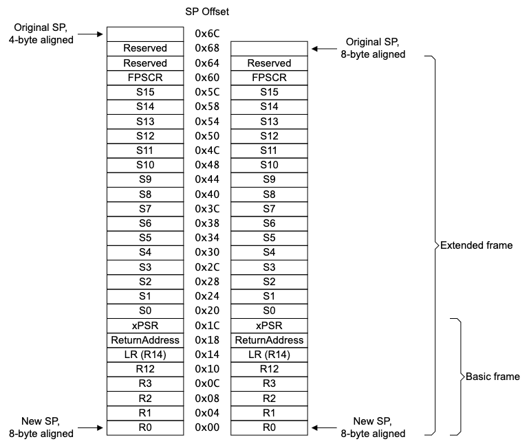

# `Va416x0::Svc::ExceptionHandler`

Handles processor exceptions triggered by the Va416x0.

The `ExceptionHandler` component will parse and report the exception frame that is pushed onto the
stack by the Va416x0 processor during exception handling, along with exception-specific registers.
For more details on the exception frame, see [Diagrams](#diagrams). The procedure is as follows:

1. Read the value of the Floating Point Context Address Register (FPCAR) which will point to the start of the exception stack frame; this is a 104-byte frame where the first 72 bytes are the floating-point state and the final 32 bytes are the general-purpose registers.
2. Parse the values of the general-purpose registers - R0, R1, R2, R3, R12, LR, Return Address, XPSR - from the stack frame.
   - LR is the LinkRegister (R14) which holds the return address from the Program Counter when a Branch-and-Link (BL) or Branch-and-Link-with-Exchange (BLX) instruction is executed
   - Return Address is the address of the instruction to which execution returns after the exception handler has completed; for our purposes these handlers will never return due to the exception FATAL but this can be used to derive the value of the Program Counter when the exception occurred
3. Read exception-specific registers to gather additional context.
   - NMI: no additional registers
   - HardFault: HardFault Status Register (HFSR)
   - MemManage: MemManage Status Register (MMFSR) and MemManage Fault Address Register (MMFAR)
   - BusFault: BusFault Status Register (BFSR) and BusFault Address Register (BFAR)
   - UsageFault: UsageFault Status Register (UFSR)
4. Downlink the FATAL `Exception` event

## Usage Examples

The input ports of the `ExceptionHandler` instance should be connected to the corresponding output
ports of the `VectorTable` instance so that it can be registered as the exception handler. Note
that the `ExceptionHandler` ports are designed for a subset of exception numbers so ensure that the
port numbers are offset appropriately using the `Va416x0Svc.ExceptionHandler.EXCEPTION_START`
constant. For example:

```
connections Exceptions {
    vectorTable.exceptions[Va416x0Types.ExceptionNumber.EXCEPTION_NMI] -> exceptionHandler.exceptions[Va416x0Types.ExceptionNumber.EXCEPTION_NMI - Va416x0Svc.ExceptionHandler.EXCEPTION_START]
    vectorTable.exceptions[Va416x0Types.ExceptionNumber.EXCEPTION_HARD_FAULT] -> exceptionHandler.exceptions[Va416x0Types.ExceptionNumber.EXCEPTION_HARD_FAULT - Va416x0Svc.ExceptionHandler.EXCEPTION_START]
    # ...
}
```

### Diagrams

The diagram below shows the format of the ARM Extended frame that is added to the stack during exception entry.

> See Armv7-M Architecture Reference Manual, Figure B1-4 Alignment options when stacking the Extended frame



### Typical Usage

And the typical usage of the component here

## Class Diagram

Add a class diagram here

## Port Descriptions

Note that the input port array is defined using the `EXCEPTION_COUNT` FPP constant, which
encompasses the range of exceptions from `EXCEPTION_NMI` to `EXCEPTION_USAGE_FAULT`.

| Kind | Name | Type | Description |
|---|---|---|---|
| `sync input` | `exceptions` | `[EXCEPTION_COUNT] Va416x0Svc.ExceptionHandler` | Input port array for exception handlers |

## Component States

`Va416x0.Svc.ExceptionHandler` is a passive component with no internal states.

## Sequence Diagrams

Add sequence diagrams here

## Parameters

None.

## Commands

None.

## Events

| Name | Message | Description |
|---|---|---|
| `Exception` | `{}: Status:0x{x} Address:0x{x} R0:0x{x} R1:0x{x} R2:0x{x} R3:0x{x} R12:0x{x} LR:0x{x} PC:0x{x} XPSR:0x{x}` | Generic exception event, displays the exception number and register values from the exception stack frame, along with an exception-specific status register and address (valid for MemManage and BusFault exceptions) |

## Telemetry

None.

## Unit Tests

Add unit test descriptions in the chart below
| Name | Description | Output | Coverage |
|---|---|---|---|
|---|---|---|---|

## Requirements

Add requirements in the chart below
| Name | Description | Validation |
|---|---|---|
|---|---|---|

## Change Log

| Date | Description |
|---|---|
| 2025-08-04 | Initial Draft |